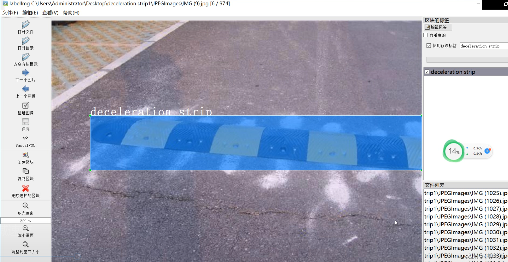
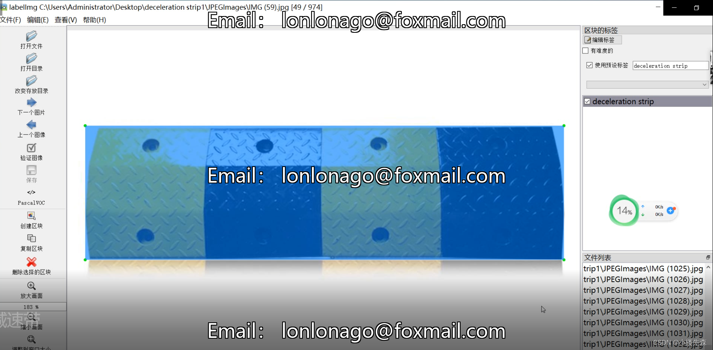
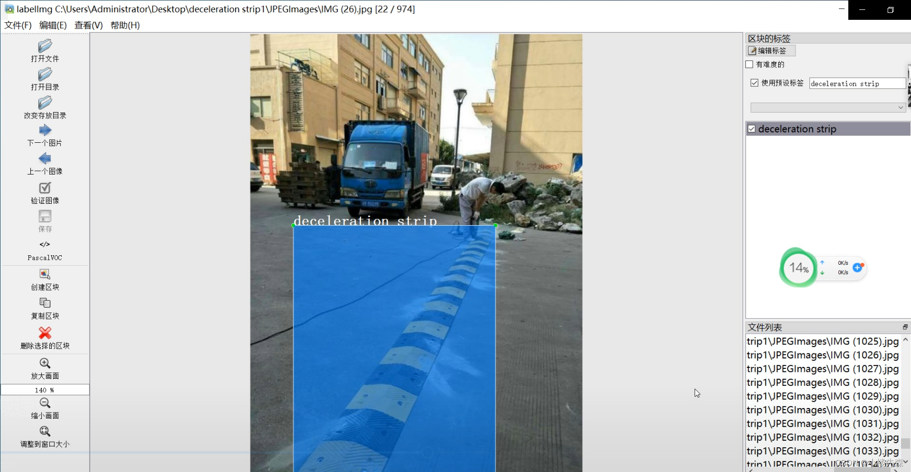
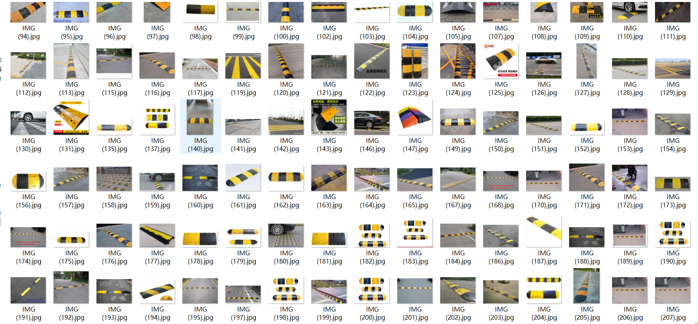

# [Object Detection Dataset] Speed Bump Dataset: Deceleration Strip Images in YOLO format

The speed bump is a traffic facility installed on highways that slows down vehicles passing through. It typically takes the form of stripes or spots, made primarily of rubber or metal, and is usually yellow and black to draw attention and cause slight bulges on the road surface to achieve deceleration purposes.

Today, we are introducing the dataset:

Dataset Name: Speed Bump Dataset

Format: Pascal VOC format (excluding the txt file containing split paths and yolo format txt files; only including jpg images and corresponding xml files)

Number of Images (JPG file count): Counted based on the number of images included in each file (around 950 images).

Number of Annotations (XML file count): Counted based on the number of annotations included in each file (around 950 annotations).

Annotation Tool: labelImg

Annotation Rules: Draw bounding boxes for categories.

Below is an example of the annotated images: (For those interested, please contact us for a fee)

## Images

---

Here is a pay link on Stripe (https://buy.stripe.com/3cs8yP7sY87d0vu9AB). Please contact me lonlonago@foxmail.com after funding $89, and I will send you a complete data files, thank you!

